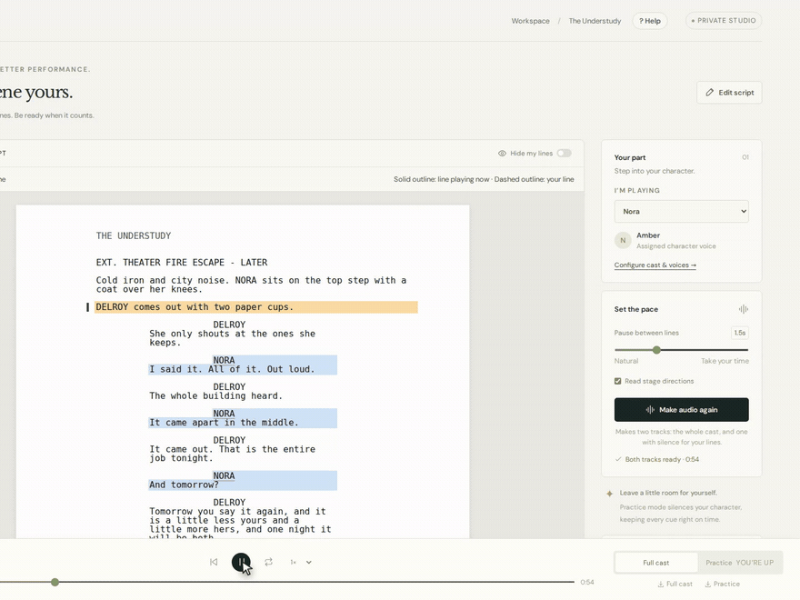
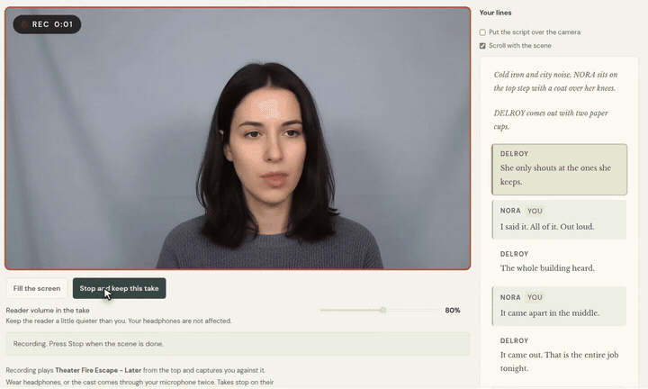

<p align="center"></p>

# Script Glow

A local rehearsal studio for actors. Import a script, pick your character, give every other part a voice, and rehearse with an AI scene partner.

Script Glow renders two tracks for any scene or the full script:

- **Full cast**: every character speaks, so you learn the rhythm.
- **Practice**: your lines become silence of the exact same length, so you speak them on cue.

By default everything runs on your own machine, and scripts and audio are not sent anywhere. No GPU? In **Settings** you can pick a hosted voice engine (OpenAI, Google Gemini or ElevenLabs) instead. Then the lines you voice are sent to that company, which charges for them.

<p align="center"></p>

<p align="center"></p>

<p align="center"><strong><a href="https://youtu.be/z8HUXr_tyC0">Watch the 0.2.0 walkthrough</a></strong> · <a href="https://youtu.be/aoRAlPY04Is">0.1.0 walkthrough</a></p>

## Features

- **Script import**: plain text, [Fountain](https://fountain.io), and text-based PDF. Scene headings, act breaks, characters, and dialogue are detected, and you can fix them in the built-in editor with a live parse preview.
- **Screenplay view**: US Letter geometry, 12 pt Courier, standard dialogue and parenthetical indents.
- **Casting**: a card for every character with voice type, voice choice, and preview. Defaults come from script descriptions and pronoun cues. Ollama (local) or a hosted engine you choose in Settings can suggest voice types when the script gives no cue. Voices already in use are greyed out.
- **Rehearsal**: full script or single scene, adjustable pause between lines, optional stage directions, loop, and 0.75× to 1.5× speed.
- **Practice tools**: hide and reveal your lines, listen only, first letters of hidden lines, wait for me on my line, continue when I stop speaking, check what I said against the script, build up line by line, and Repeat A/B looping of one exchange.
- **Script marking**: separate highlight and playback colors for your role or any character. Marks stay visible in print.
- **Self-tape**: record yourself on camera against the cast audio, with a count-in, a recording light, and the script beside or over the camera. Trim a take and make an MP4 for casting sites, with a check against Casting Networks, Eco Cast and Spotlight.
- **Voice engines**: the included Chatterbox server (free and private, best with an NVIDIA GPU), or ElevenLabs, OpenAI, or Google Gemini as paid, hosted alternatives. Record your own voice for your role with Chatterbox.
- **Project library**: many projects on disk, listed with edit dates, rename and delete, autosave, `.sgbackup` export and restore, and render reuse when inputs match.
- **Downloads**: full-cast and practice WAV files.
- **In-app guide**: press **? Help** in the top bar, or the small **i** beside any screen heading to open the guide at that section. **Ask for help on GitHub** opens an issue with your version and browser already filled in.

## Requirements

| Component | Required | Purpose |
| --- | --- | --- |
| [Node.js](https://nodejs.org) 24+ | Yes | Runs the app and API |
| Built-in voices, a voice server, or a hosted voice key | Yes, for audio | Reads the script aloud. The built-in voices need nothing else: they run on this computer's CPU and download about 360 MB once. Or use the included [voice server](voice-server/README.md) (Chatterbox, Python 3.12, NVIDIA GPU recommended), or any server with `GET /health`, `GET /v1/voices`, and `POST /v1/tts` (`{ "text", "voice" }` in, WAV out). **Record my voice** also needs `PUT /v1/voices/<name>`. Or skip the server and use an OpenAI, Google Gemini or ElevenLabs API key. |
| [Ollama](https://ollama.com) or a hosted AI key | Optional | AI voice-type suggestions from character names. Ollama needs an installed model; OpenAI, Claude, Gemini, Grok or OpenRouter need a key. |
| WhisperX server | Optional | **Check what I said** compares your spoken line with the script. Also used by the health check and the verification scripts. Any server with `POST /v1/audio/transcriptions` (multipart `file`, `model`, `language`; `{ "text" }` out) works. |
| [FFmpeg](https://ffmpeg.org) | Optional | Faster, exact trim-to-MP4 for self-tapes. Put `ffmpeg` on the PATH or set `SCRIPT_GLOW_FFMPEG` to the program. Without it, Chrome and Edge make the MP4 by playing the take once. `SCRIPT_GLOW_FFMPEG` must point at the program itself, not a `.cmd` or `.bat` file. |

The tests run on Windows, Linux and macOS on every push. The app and the browser checks are used daily on Windows.

Browsers: current Chrome and Edge do everything. Firefox and Safari rehearse and record takes (Firefox records WebM, Safari records MP4); to trim a take into an MP4 there, install FFmpeg.

## Install

### Download (Mac, Windows and Linux)

Download Script Glow for your computer from the [latest release](https://github.com/Mariano215/script-glow/releases/latest):

- Mac with Apple silicon (M1 or later): the `.dmg` whose name ends in `-arm64.dmg`.
- Mac with an Intel processor: the `.dmg` whose name ends in `-x64.dmg`.
- Windows: the `.exe`.
- Linux on an Intel or AMD machine: the `.AppImage` whose name ends in `-x86_64.AppImage`.
- Linux on an ARM machine: the `.AppImage` whose name ends in `-arm64.AppImage`.

The Mac files are signed and notarized. The Windows installer is signed as Mariano Mattei, so Windows starts it without a SmartScreen warning. AppImages are never signed: run `chmod +x` on the file before you start it.

Open it and follow the welcome screen. You do not need Node or a terminal.

The app keeps your projects and settings in your user folder: `~/Library/Application Support/Script Glow` on a Mac, `%APPDATA%\Script Glow` on Windows, `~/.config/Script Glow` on Linux. The key file for paid voice services stays in your user settings folder, the same one `npm start` uses: `~/.config/script-glow` on a Mac and on Linux, `%APPDATA%\script-glow` on Windows.

### From source

```sh
git clone https://github.com/Mariano215/script-glow.git
cd script-glow
npm install
```

## Set up voices

Pick one:

- **Built-in voices (free, private, any laptop, no setup).** Choose **Free voices on this computer** on the welcome screen, or **Built-in voices** under **Who reads the other parts** in Settings. The voice files, about 360 MB, download once into your user folder and are checked before use; a broken download resumes when you press **Try again**. There are 28 English voices, US and UK. They cannot sound like you: **Record my voice** needs Chatterbox. Hidden until the Misaki word-list provenance question is settled ([hexgrad/misaki#107](https://github.com/hexgrad/misaki/issues/107)); until then, set `SCRIPT_GLOW_EXPERIMENTAL_KOKORO=1` to turn them on for development.
- **On your own machine (free, private, best with an NVIDIA GPU).** Follow [voice-server/README.md](voice-server/README.md) to install the voice server and the free stock voices. Start it before Script Glow. On a Mac it runs on the CPU, which works but is slow.
- **Hosted (paid, any laptop).** Start Script Glow, open **Settings**, choose ElevenLabs, OpenAI or Google Gemini under **Who reads the other parts**, press **Add key** under **Keys for paid services**, paste your API key and press **Save key**. Then press **Test the key**, and **Save changes**. Each line is voiced once and kept, so rehearsing the same scene again costs nothing.

## Configure

The defaults work with the included voice server on the same computer, so this step is optional. The **Settings** screen writes this profile for you, and its changes apply at once. To edit it by hand, copy the example profile:

```sh
node -e "require('fs').mkdirSync('data', { recursive: true })"
cp connections.example.json data/connections.json      # Windows cmd: copy connections.example.json data\connections.json
```

```json
{
  "version": 1,
  "name": "My local services",
  "voice": { "engine": "chatterbox", "model": "" },
  "names": { "engine": "ollama", "model": "" },
  "chatterbox": { "url": "http://127.0.0.1:8095", "cacheNamespace": "my-chatterbox", "legacyCache": false },
  "whisperx": { "url": "http://127.0.0.1:8010" },
  "ollama": { "url": "http://127.0.0.1:11434", "model": "" },
  "casting": { "preferredActorVoice": "", "aliases": {} }
}
```

| Field | Meaning |
| --- | --- |
| `voice.engine` | `chatterbox` (local), or `openai`, `gemini`, `elevenlabs` (hosted, needs a key). Optional; missing means `chatterbox`. |
| `voice.model` | Hosted model name. Empty uses the recommended one. |
| `names.engine` | Who guesses voice types from character names: `ollama` (local, uses `ollama.model`), or `openai`, `anthropic`, `gemini`, `xai`, `openrouter` (hosted, needs a key; only the names are sent). Optional; missing means `ollama`. |
| `names.model` | Hosted model name for name guesses. Empty uses the recommended one. |
| `chatterbox.url` | Base URL of the TTS server. |
| `chatterbox.cacheNamespace` | Keeps the line cache separate for each voice server. |
| `whisperx.url` | Base URL of the optional WhisperX server. |
| `ollama.url`, `ollama.model` | Ollama server and an installed model name. An empty model turns AI suggestions off. |
| `casting.preferredActorVoice` | Voice ID of your own cloned voice, used for your role when available. **Record my voice** in Settings sets it for you. |
| `casting.aliases` | Maps other voice IDs to one canonical ID. |

Rules:

- `data/connections.json` is gitignored. Without it, the app uses loopback defaults.
- To use a file somewhere else, set `SCRIPT_GLOW_CONFIG=/path/to/profile.json`. Settings are saved back to that file.
- URLs must be HTTP(S) and cannot contain credentials, a query string, or a fragment. Do not put API keys in the profile. Invalid profiles stop startup with an error.
- **Record my voice** keeps a private copy of your recording in `data/voice-previews/actor-preview.wav`. You can also put a WAV there by hand.

Restart the app after you edit the file by hand. See [docs/connections.md](docs/connections.md) for the details.

Environment variables:

| Variable | Meaning |
| --- | --- |
| `PORT` | App port (default `3001`). A second copy on another port still shares `data/` and `.cache/`. |
| `SCRIPT_GLOW_CONFIG` | Path of the connection profile (default `data/connections.json`). |
| `SCRIPT_GLOW_SECRETS` | Path of the key file (default in your user settings folder, see below). |
| `SCRIPT_GLOW_HOME` | Folder for `data/` and `.cache/` (default: the code folder). The desktop app sets it to your user folder. |
| `SCRIPT_GLOW_FFMPEG` | Path of the FFmpeg program, when it is not on the PATH. |
| `SCRIPT_GLOW_EXPERIMENTAL_KOKORO` | Set to `1` to turn on the built-in voices before release. They are otherwise hidden until `server/kokoro/release-gate.json` sets `misakiProvenanceCleared` to `true`, which waits on [hexgrad/misaki#107](https://github.com/hexgrad/misaki/issues/107). |

### A voice server on another computer

If the voice server runs on another machine (for example a desktop with a GPU), start it with `VOICE_HOST`, `VOICE_ALLOWED_HOSTS` and `VOICE_TOKEN` as described in [voice-server/README.md](voice-server/README.md). In Script Glow, set the Chatterbox server address in **Settings > Advanced**, and add the same token under **Keys for paid services > Voice server token**.

## Run

Development (API on port 3001, Vite UI with hot reload):

```sh
npm run dev
```

Open http://127.0.0.1:5173.

Desktop window (development):

```sh
npm run desktop
```

Compiled app:

```sh
npm run build
npm start
```

Open http://127.0.0.1:3001.

## How to rehearse

1. Open **Projects** and click **New project from a script**, or use the included sample.
2. Click **Edit script** to check the parsed scenes and characters.
3. Open **Cast**. Click **I'm playing this role** on your character. Pick and preview a voice for every other character. If a name comes out wrong, type how it sounds in **Say it like**, for example `shi-VAWN` for Siobhan. Capitals mark the stressed part, and it works with every voice engine.
4. Open **Rehearsal**. Choose **Full script** or one scene and press **Play**. The first render is slower while the voice engine loads its model.
5. Listen in **Full cast**, then switch to **Practice** and speak your lines in the gaps. Hide my lines, Listen only, first letters, wait for me, continue when I stop speaking, check what I said, build up line by line, and Repeat A/B all help you learn a scene.
6. Download either WAV to rehearse away from the app, or open **Self-tape** to record yourself against the cast, trim the take, and make an MP4 for casting sites.

Changes to the script, cast, your role, pause length, or stage directions need new audio. Speed and highlight colors do not. Scene labels show **Audio ready** or **Audio not made yet**.

### Script format tips

- Give each scene its own heading: `INT.`/`EXT.`, a numbered heading, `SCENE 1`, or a Fountain heading such as `.THE GARDEN`.
- If a break is not detected, add `# Scene title` above the scene.
- Put character names in uppercase above dialogue, or write `NAME: dialogue`.
- Scanned (image-only) PDFs need OCR before import.

## Projects and data

| Location | Contents | Git |
| --- | --- | --- |
| `data/projects/` | Projects, manifests, saved render WAVs, and self-tape takes | Ignored |
| `data/projects/.trash/` | Deleted projects, kept until moved back by hand | Ignored |
| `data/connections.json` | Your connection profile | Ignored |
| `data/voice-previews/` | Your own voice sample, if you recorded one | Ignored |
| `~/.config/script-glow/secrets.json` (or `%APPDATA%\script-glow\secrets.json`) | Hosted service API keys | Not in this repo |
| `.cache/` | Line audio cache (512 MiB) and export cache (1 GiB), oldest files removed first | Ignored |
| `models/kokoro-v1/` | Built-in voice files, about 360 MB, downloaded once. **Remove downloaded voices** in Settings deletes them | Ignored |
| `artifacts/` | Verification output | Ignored |

- Settings autosave. Wait for **Saved locally**. Script text needs **Save script** in the editor.
- Projects are listed with their last edited date. Rename the open project by editing its name; **Delete** moves a project's script, audio, and takes to `data/projects/.trash`, where they can be moved back by hand.
- **Export backup** writes a `.sgbackup` with the script, cast, settings, and scene audio, not your self-tapes or your keys. **Restore backup** always creates a new project.
- Limits: 1,000 projects and 4 GiB per backup. Each project keeps its 200 newest audio versions, and up to 50 self-tape takes at 512 MiB each. Older audio versions and their WAV files are removed automatically, because the audio can always be made again.
- Render limits: full script up to 5,000 lines, 500,000 characters, and 2 hours of audio. One scene up to 300 lines, 60,000 characters, and 30 minutes. One speech can be up to 20,000 characters; long speeches are split into sentences for the voice service and joined back together.
- A self-tape stops itself after 5 minutes; a slate recorded on its own stops after 1 minute.
- Keep backups on a different drive.

## Security

Script Glow is a single-user local app with no login. The server listens on `127.0.0.1` only, checks the `Host` and `Origin` headers, refuses to be shown inside another page, and accepts changes from the browser only with a secret made new at each launch. Do not expose it to a network. API keys for hosted services are kept in your user settings folder (`~/.config/script-glow/secrets.json`, or `%APPDATA%\script-glow\secrets.json` on Windows; set `SCRIPT_GLOW_SECRETS` to move it), with owner-only access, never in `data/connections.json`, never in a project backup, and never sent back to the browser once saved. **Continue when I stop speaking** opens the microphone while practice mode waits on your line, and reads only how loud the room is. No recording is made, nothing is written to disk and nothing leaves the browser. Switch it off on the Practice card and the microphone is released. **Check what I said**, off unless you switch it on, is the one exception: with it on, each of your lines is recorded for as long as you speak it and sent to the WhisperX address you set, which is a machine you chose. The clip is held in memory, never written to disk, and dropped as soon as the answer comes back. If you choose a hosted voice engine (ElevenLabs, OpenAI, or Google Gemini), the lines of the scene you voice are sent to that company each time you make new audio; lines already made are cached and never sent again. If you choose a hosted engine for name guessing (OpenAI, Claude, Gemini, Grok, or OpenRouter), only the character names are sent. Your script file, your settings, and your self-tapes are never sent to either kind of service. With Chatterbox and Ollama on this computer, nothing leaves the machine. When they run on another computer, the lines, names and your voice recording go to that computer; protect a remote voice server with `VOICE_TOKEN`. On Windows, file permissions come from the folder: the key file is private in your user folder, while `data/` has the permissions of the folder you cloned into. See [SECURITY.md](SECURITY.md). Imported scripts and backups are treated as untrusted input: size limits apply, text is escaped before rendering, and PDFs are parsed in a separate process with memory and time limits.

## HTTP API

The UI uses these local endpoints. They are internal and can change.

| Method | Path | Purpose |
| --- | --- | --- |
| GET | `/api/session` | This launch's session token, used to authorize writes from the page |
| GET | `/api/health` | Status of the voice and transcription services |
| GET | `/api/connections` | Effective non-secret connection settings |
| PUT | `/api/connections` | Save the connection profile (voice engine, name-guessing engine, server addresses) |
| POST | `/api/connections/test` | Check one configured service and report whether it answers |
| GET | `/api/secrets` | Which hosted providers have a key, with a short hint. Never the key |
| PUT, DELETE | `/api/secrets/:provider` | Store or remove one provider's key |
| GET | `/api/tools` | Whether FFmpeg is available |
| GET | `/api/projects/:id/takes` | List self-tape takes for a project |
| POST | `/api/projects/:id/takes` | Save a recorded take (`video/webm` or `video/mp4`) |
| GET | `/api/projects/:id/takes/:file` | Play or download a take |
| PATCH | `/api/projects/:id/takes/:file` | Rename a take |
| DELETE | `/api/projects/:id/takes/:file` | Delete a take |
| POST | `/api/projects/:id/takes/:file/mp4` | Trim a take (`{ start, end }` in seconds) and save an MP4 beside it |
| GET | `/api/voices` | Voice IDs from the chosen engine, with labels and genders for hosted voices |
| GET | `/api/voices/preview?voice=&session=` | A short sample of a hosted or built-in voice, made once and cached |
| GET | `/api/kokoro` | Whether the built-in voice files are here, and how far a download has got |
| POST | `/api/kokoro/download` | Start the download of the built-in voice files, or join the one running |
| DELETE | `/api/kokoro` | Remove the built-in voice files |
| POST | `/api/import` | Extract text from an uploaded PDF (10 MB max) |
| POST | `/api/voices/mine?name=` | Send a recording of your own voice (`audio/wav`, 5 to 30 s) to Chatterbox and use it for your role |
| POST | `/api/casting/guess-genders` | AI voice-type suggestions for character names |
| POST | `/api/render` | Start a render job |
| GET | `/api/jobs/:id` | Render job progress and result |
| POST | `/api/jobs/:id/cancel` | Cancel a render job |
| GET | `/audio/:filename` | Cached render audio |
| GET, POST | `/api/projects` | List or create projects |
| GET, PUT, DELETE | `/api/projects/:id` | Read, save, or delete a project (delete moves it to `data/projects/.trash`) |
| POST | `/api/projects/:id/renders` | Save a finished render to the project |
| GET | `/api/projects/:id/audio/:filename` | Saved project audio |
| GET | `/api/projects/:id/backup`, `/backup-info` | Download a backup, or list the audio it will contain |
| POST | `/api/projects/restore` | Restore a backup as a new project |
| GET | `/private-voice-preview.wav` | Optional local actor voice preview |

## Development

```sh
npm test          # unit and API tests (node:test)
npm run build     # type check and production build
```

Browser checks start their own throwaway app with fake voices (no GPU, no real data). They need a build and a browser:

```sh
npm run build
npx playwright install chromium
node verification/browser.mjs              # also: ai-casting, casting-playback, finish-tape,
                                           # highlighting-scenes, numbered-scenes, own-voice,
                                           # practice-controls, project-library, render-guard,
                                           # self-tape, settings, studio-workspace, voice-library,
                                           # builtin-voices, say-it-like, listening
```

Checks against a running app on port 3001 (`npm start` first; GPU checks need the voice server and should run one at a time):

```sh
node verification/pdf-import.mjs
node verification/sidebar-order.mjs
node verification/live-render.mjs          # renders a short scene, checks silence and timing
node verification/transcribe-render.mjs    # optional: checks words with WhisperX
node verification/voice-auditions.mjs      # optional: audition clips for stock voices
```

Service scripts read the URLs from your connection profile. Output goes to `artifacts/`.

### Project layout

```
server/        Express API: rendering, projects, takes, PDF import, casting AI, hosted services, keys, FFmpeg, connection profile
server/kokoro/ Built-in voices: text to phonemes (Misaki port), model file download, the worker process
voice-server/  Optional Chatterbox voice server (Python)
src/           Vite + TypeScript UI: parser, casting, playback, self-tape, highlights, help, styles
tests/         node:test suites
verification/  Browser (Playwright) and live-service checks
scripts/       Voice reference installers and manifests, built-in voice file preparation, license notices
public/        Logo, bundled fonts, voice preview clips
docs/          User guides and README media
```

### Documentation

- [Connection profile and keys](docs/connections.md)
- [Stock voices and your own voice](docs/voices.md)
- [Voice server](voice-server/README.md)

## Credits and licenses

- Fonts: DM Sans and Libre Baskerville, SIL Open Font License. See [public/fonts](public/fonts/README.md).
- Voice previews: generated by Chatterbox from CC0 references ([Kokoro Voices](https://github.com/n33kos/kokoro-voices), [Voice-Zero](https://github.com/OwenTyme/voice-zero)). See [public/voice-previews](public/voice-previews/README.md). No personal voice samples are included.
- Built-in voices: [Kokoro-82M](https://huggingface.co/hexgrad/Kokoro-82M) by hexgrad, the [Misaki](https://github.com/hexgrad/misaki) word lists and G2P (ported to JavaScript), and PeterReid's grapheme-to-phoneme models, all Apache-2.0. Nothing GPL is used: no espeak-ng. Every component that ships or is downloaded, with its license text: [THIRD_PARTY_NOTICES.md](THIRD_PARTY_NOTICES.md).
- Script Glow code: [MIT License](LICENSE). See [CONTRIBUTING.md](CONTRIBUTING.md), [SECURITY.md](SECURITY.md) and [CHANGELOG.md](CHANGELOG.md). Bundled fonts and voice previews keep their own licenses above.
